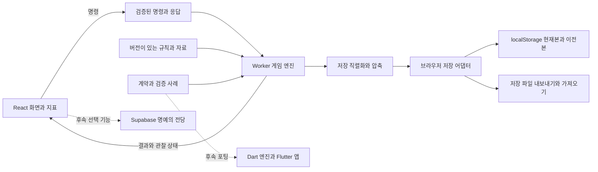

> as of ARCH@2 HIST@1 | 261007 | 독자: 프로젝트 기획자와 구현자

# 웹 데모 개발 계획과 Flutter 출시 방향

이 계획서는 웹 데모의 구성, 저장을 보호하는 방법, 구현 순서와 배포 기준을 설명합니다. 기술 결정의 정본은 [ARCH](ssot/ARCH.md)입니다. 기획 SSOT와 구현 태스크를 만든 뒤 태스크마다 검증하고 커밋합니다. 웹을 먼저 완성합니다.

## 먼저 웹에서 게임의 재미를 증명합니다

웹 데모의 목표는 링크를 열고 클럽을 만들어, 경기와 지표를 보며 계속 플레이하고 싶게 만드는 것입니다. 사용자는 선수와 공이 움직이는 단순한 경기를 관찰합니다. 감독에게 전술을 요구하거나 선수를 영입하고, 마케팅과 후원을 시도합니다. 변화한 지표와 클럽의 역사가 다음 선택을 만듭니다.

첫 운영 국가는 잉글랜드·스페인·독일·이탈리아·프랑스·포르투갈·네덜란드·벨기에입니다. 다른 유럽 국가는 유럽대회 참가용 대표 클럽으로 다룹니다. 초기 자본금 난이도, 성격 있는 감독, 역사 물가와 화폐, 시대별 유럽대회는 웹의 완성 목표에 포함합니다.

계정 없이 시작하고 진행은 브라우저에 저장합니다. Supabase 명예의 전당은 웹을 완성한 뒤 추가할 선택 기능입니다. Flutter 앱의 상용 출시도 후속 단계로 둡니다. 초기 웹 게임의 진행과 저장은 이 서비스들에 의존하지 않습니다.

## 화면과 게임 규칙을 나눕니다

웹 화면은 React·TypeScript·Vite로 만듭니다. 빌드 결과는 정적 파일입니다. CSS Modules로 화면 스타일을 관리하고, 경기장은 Canvas 2D, 초기 그래프는 SVG, 지표 비교는 읽기 쉬운 HTML 표로 표현합니다.

게임 규칙은 화면에서 분리한 엔진이 실행합니다. 세계 생성, 경기, 영입, 돈의 흐름과 대회 진행을 이 엔진이 맡습니다. 엔진은 Web Worker라는 별도 실행 공간에서 동작합니다. 화면은 명령을 보내고 엔진이 계산한 지표와 상태를 받아 보여 줍니다.

이 구분 덕분에 관람 속도나 화면 전환이 경기 결과를 바꾸지 않습니다. 같은 초기값과 명령, 규칙으로 진행하면 같은 결과를 얻도록 검증합니다. 실제 현재 날짜와 기기 시간대도 선수의 나이나 게임의 연도를 바꾸지 않습니다.

클럽·선수·감독·대회는 안정적인 식별자로 연결합니다. 과거 기록은 당시 값을 보존합니다. 선수를 팔거나 감독이 사임한 뒤에도 지난 시즌의 선수단과 기록을 확인합니다. 감독에게 요구한 전술, 감독의 반응, 실제 적용한 전술도 나눠 기록합니다.

프로젝트의 주요 경계는 다음과 같습니다.

| 위치 | 맡는 일 |
|---|---|
| `apps/web` | 화면, 경기 표현, 브라우저 저장과 Worker 연결 |
| `packages/contracts` | 명령·결과·저장·자료 형식과 검증 규칙 |
| `packages/engine` | 화면에 의존하지 않는 게임 규칙과 상태 |
| `packages/catalogs` | 국가·이름·대회 연혁·물가·화폐 자료 |
| `fixtures/portable` | 웹과 향후 Dart 엔진을 비교할 초기값·명령·기대 결과 |
| `tests/e2e` | 실제 브라우저에서 진행·저장·복구·배포 결과 확인 |

프레임마다 큰 세계 전체를 화면에 전달하지 않습니다. 필요한 경기와 지표의 변경분을 전달합니다. 표는 정렬과 필터를 적용한 뒤 기본 50행씩 보여 줍니다. 차트가 표시하는 점의 수도 제한해 긴 역사를 읽는 화면의 작업량을 관리합니다.

## 저장을 먼저 검증합니다

웹의 저장소는 요청한 localStorage입니다. 현재 세계 한 개와 복구용 이전 저장본 한 개를 유지합니다. 다른 세계를 보관하려면 파일로 내보내고 다시 가져옵니다.

localStorage는 일반적으로 같은 사이트 출처에 약 5 MiB를 제공하며 읽기와 쓰기가 동기식입니다. 이 제약 때문에 큰 게임 상태를 프레임마다 저장하지 않습니다. [브라우저 저장 용량 설명](https://developer.mozilla.org/en-US/docs/Web/API/Storage_API/Storage_quotas_and_eviction_criteria), [Web Storage 설명](https://developer.mozilla.org/en-US/docs/Web/API/Web_Storage_API)

저장 파일은 버전과 규칙 자료의 식별자, 압축한 게임 상태, 손상을 확인할 체크섬을 담습니다. 직렬화·압축·검증은 Worker에서 하고, 브라우저 어댑터가 localStorage에 씁니다. 파일 형식은 `.haeram-save.json`으로 정해 향후 Flutter에서도 읽도록 계획합니다.

저장은 다음 순서로 진행합니다.

1. 새 저장 내용을 완성하고 검증합니다.
2. 현재 저장본과 다른 슬롯에 씁니다.
3. 기록한 내용이 올바른지 확인합니다.
4. 현재 저장본을 가리키는 작은 표식을 바꿉니다.
5. 그 뒤에 저장 성공을 알립니다.

새 저장이 실패하면 이전 저장본을 남깁니다. 현재 메모리에 있는 진행 상태는 내보내기나 재시도에 사용할 수 있게 합니다. 자동 저장은 경기·기간의 확정 결과와 인력·경제 결정이 끝나는 경계에서 수행합니다. 화면에는 마지막으로 저장한 상태와 아직 저장하지 못한 변경을 구분합니다.

저장본이 손상되면 검증한 이전본으로 복구합니다. 두 저장본을 읽지 못하더라도 새 게임으로 덮어쓰지 않습니다. 가져온 파일은 검사와 버전 변환을 마친 뒤 적용합니다. 다른 탭에서는 같은 세계를 동시에 진행하지 못하도록 하고 읽기만 허용합니다.

현재 계획의 초기 저장 예산은 저장본당 최대 **1.5 MiB**, 이전본과 설정을 포함한 전체 **3.5 MiB**입니다. 문자열이 차지하는 크기를 보수적으로 계산하고 실제 브라우저의 용량 오류도 처리합니다.

이 수치는 이미 달성한 결과가 아닙니다. 큰 기능의 화면을 다 만들기 전에 8개국 세계의 창단 시점, 경력 중간, 100시즌 후 저장을 시험합니다. 결과가 예산에 맞지 않으면 기록 형식과 상세 보존 범위를 먼저 해결합니다. 이 검증에 실패한 상태로 긴 역사가 안정적으로 저장된다고 발표하지 않습니다.

긴 기록에는 확정된 경기 결과, 순위·우승, 클럽의 선택, 선수와 감독의 경력, 경제 기록을 남깁니다. 화면의 프레임별 좌표나 React 상태는 저장하지 않습니다. NPC의 오래된 기록은 시즌·경력 요약으로 보관하고, 우리 클럽의 경기·선수 기록은 자세히 유지합니다. 중요한 클럽 기록을 알리지 않고 지우는 방법은 사용하지 않습니다.

## 구현 단계마다 확인할 결과를 정합니다

최종 웹 목표에는 앞서 정한 게임 기능을 포함합니다. 중간에 경기 하나를 볼 수 있는 버전이 나와도 전체 웹 게임이 완성된 것으로 표시하지 않습니다.

| 단계 | 만드는 것 | 다음 단계로 가는 기준 |
|---|---|---|
| 제품 규칙 정리 | 데모·경기·저장 등 도메인 SSOT, 필요한 초기 규칙과 자료 범위 | 명령과 결과, 소유하는 데이터, 필요한 규칙이 분명함 |
| 기본 구조 | 프로젝트 구조, 형식 검증, 순수 엔진, Worker 연결, 검증 명령 | 같은 검증 사례에서 같은 결과가 나옴 |
| 저장 가능성 | 압축 저장, 이전본 복구, 버전 변환, 내보내기 | 8개국·100시즌 시험이 저장 예산에 맞음 |
| 첫 플레이 흐름 | 클럽 창단, 국내 경기, 경기장 관찰, 지표, 이어하기 | 엔진이 계산한 경기를 보고 재접속해 계속함 |
| 전체 게임 흐름 | 영입, 감독 요구와 갈등, 사업, 역사 경제, 유럽대회, 연대기 | 선택이 실제 지표·돈·일정·기록에 반영됨 |
| 웹 출시 검증 | 모바일 화면, 오류 복구, 실제 자료, 배포와 롤백 | 브라우저 검사와 장기 저장 검증을 통과함 |
| 후속 명예의 전당 | 점수 규칙과 Supabase 연결 | 공개 기록의 의미와 제출 규칙을 정하고 게임과 독립적으로 동작함 |
| 후속 Flutter 출시 | Dart 엔진, Flutter 화면·저장, 앱 패키징 | 웹과 같은 검증 사례와 저장 호환성 확인 |

국가와 대회의 자료도 테스트 대상입니다. 예를 들어 리그 정원과 승강 후의 팀 수, 유럽대회의 창설 시점, 화폐 전환과 고정 계약 금액을 확인합니다. 시험용 작은 세계가 실행됐다는 사실만으로 실제 8개국 자료가 준비됐다고 판단하지 않습니다.

엔진의 규칙 검증은 Vitest와 fast-check로 계획합니다. 브라우저에서 창단부터 경기·영입·감독 요구·저장·다시 열기까지 이어지는 과정은 Playwright로 확인합니다. 중복 명령, 저장 용량 초과, 손상된 파일, 여러 탭과 Worker 장애도 이 과정에 포함합니다.

`npm run verify`는 타입·코드 규칙·문서화한 포맷, 규칙·계약 테스트, 자료 검증, 빌드와 브라우저 검사를 묶는 명령으로 만들 예정입니다. `npm run benchmark`는 저장 용량과 장기 세계를 측정합니다. 현재는 앱과 이 명령들을 아직 만들지 않았으며, 실행 결과가 있다고 보고하지 않습니다.

빠른 첫 진입도 측정합니다. 초기 화면의 JavaScript와 CSS는 압축 전송 기준 250 KiB 이내를 목표로 합니다. 뒤에 읽는 엔진과 자료의 크기는 따로 보고합니다. 고정한 Chromium에서 CPU를 4배 느리게 설정하고 Fast 4G로 첫 접속을 시험합니다. 일반 진행 중 조작 피드백은 p95 100 ms 미만, 모바일 크기의 경기 화면은 30 FPS 이상, 올바른 창단 명령 뒤 세계 초기화는 5초 이내가 목표입니다. 이 수치들도 구현 뒤 측정할 기준이며 현재의 성능 결과는 아닙니다.

## 배포를 반복해도 저장은 이어지게 합니다

웹은 GitHub Actions에서 고정한 도구와 의존성으로 검증하고 빌드합니다. 검증을 통과한 보호된 운영 브랜치를 Cloudflare Pages에 정적으로 배포하는 구성을 계획합니다. 검토용 주소에서는 화면·Worker·직접 주소 재접속과 실제 빌드의 동작을 확인합니다. 검토 배포가 운영 주소를 바꾸지 않게 합니다.

운영 주소는 공개 전에 정합니다. localStorage는 출처별로 나뉘므로 다른 도메인이나 검토용 주소의 저장을 운영 주소가 자동으로 읽는다고 가정하지 않습니다. 주소를 바꾸면 저장 파일로 이동합니다.

코드와 규칙 자료에는 버전을 붙입니다. 저장 형식이 바뀌면 기존 저장본을 검증 사례로 두고 변환합니다. 코드를 이전 배포로 되돌려도 저장을 삭제하지 않습니다. 이전 코드가 새 저장 형식을 읽지 못하면 복구·내보내기 경로로 안내합니다.

이 단계에서는 운영 서버나 게임 데이터베이스를 관리하지 않습니다. 배포는 정적 파일과 자료를 중심으로 유지합니다. 운영 저장을 오래 이어가는 데 필요한 버전 호환성과 복구는 웹의 출시 기준에 포함합니다.

## Flutter로 옮길 때 가져갈 것과 새로 만들 것

웹에서 검증한 규칙, 국가·대회·경제 자료, 저장 형식과 시험 사례를 Flutter에서도 사용합니다. 웹의 TypeScript 엔진은 Dart로 포팅하고 화면은 Flutter로 만듭니다. TypeScript나 React 코드를 그대로 실행할 수 있다고 계획하지 않습니다.

새 Dart 엔진에는 같은 초기값과 명령을 넣습니다. 경기·돈·대회·역사의 확정 결과가 웹과 맞는지 비교합니다. 이 검증이 앱에서 웹 저장 파일을 읽고 이어가는 기준이 됩니다. 앱의 실제 저장 장치는 파일이나 앱 로컬 데이터베이스 어댑터로 별도 구현합니다.

Supabase는 우선 명예의 전당만 담당합니다. 전체 게임 저장을 자동으로 서버에 올리지 않습니다. 제출에는 별명과 세계·규칙 버전, 국가, 난이도, 시즌 수와 점수·우승 요약 정도만 쓰는 것으로 계획합니다. 실제 제출·공개 정책은 후속 제품 명세에서 정합니다.

클라이언트의 로컬 기록은 사용자가 바꿀 수 있습니다. 따라서 명예의 전당을 단순한 기록 공유로 할지, 서버에서 검증한 순위로 할지는 따로 정해야 합니다. 저장 체크섬과 데이터 접근 제어만으로 게임 결과의 정직함을 증명한다고 설명하지 않습니다. 명예의 전당 서버가 멈춰도 로컬 게임과 저장은 계속 동작하게 합니다.

## 지금 완료한 계획과 남은 결정

완료한 것은 아키텍처 정본과 이 계획서입니다. 앱 구현·의존성 설치·배포·Supabase 설정·Flutter 프로젝트 생성은 이번 단계에서 실행하지 않았습니다.

기술 정본에 남긴 미정 항목은 두 가지입니다.

- 명예의 전당 점수와 분류, 공개·소유 정책, 기록의 검증 수준.
- 운영 저장소·Cloudflare 계정·고정 운영 주소.

기획 쪽에서는 8개국의 상세 자료와 경기·경영·감독의 세부 규칙도 마무리해야 합니다. 다음 작업은 필요한 제품 규칙을 SSOT로 옮기고, 이 아키텍처를 참조하는 구현 태스크를 만드는 것입니다. 웹부터 완성한다는 순서는 유지합니다.
